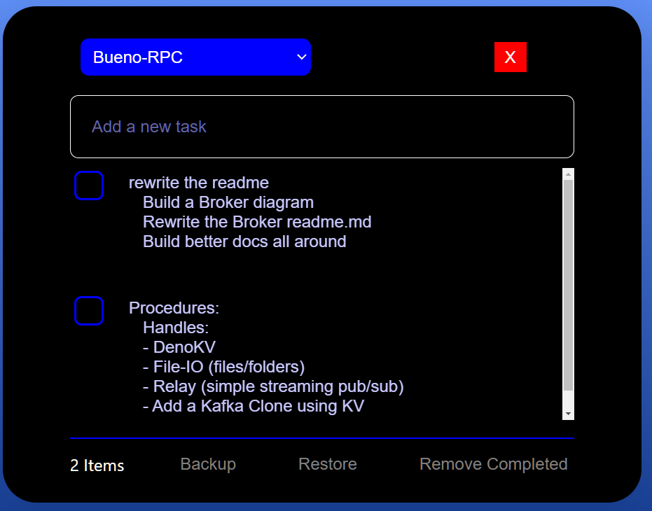
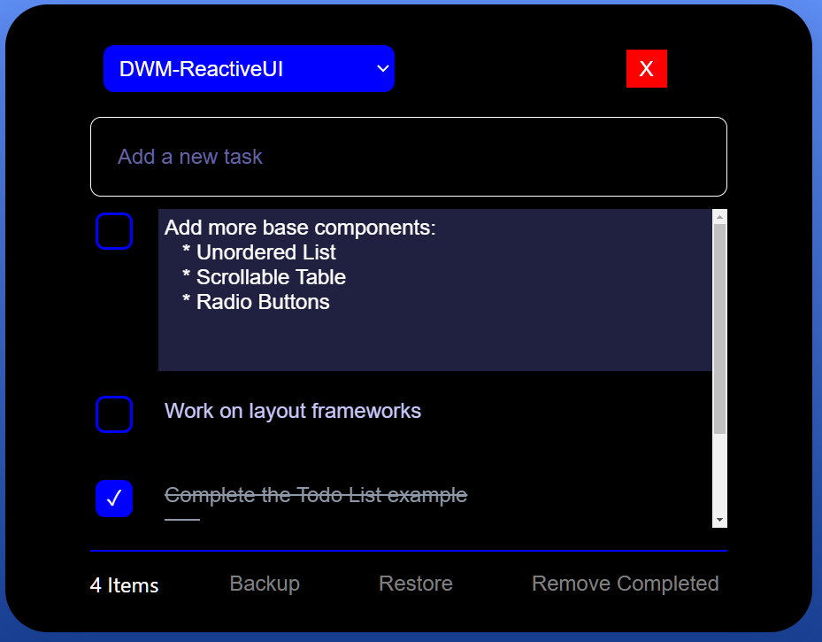
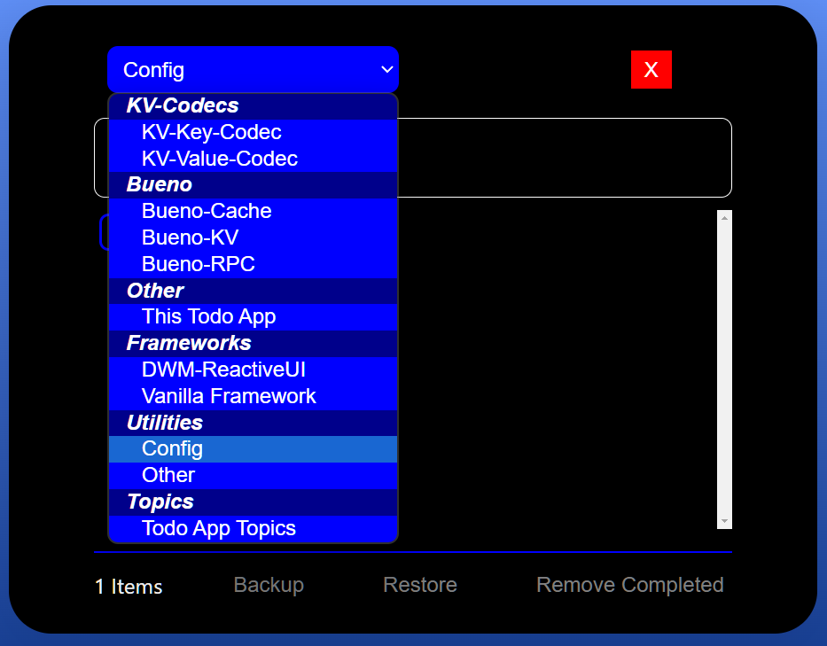
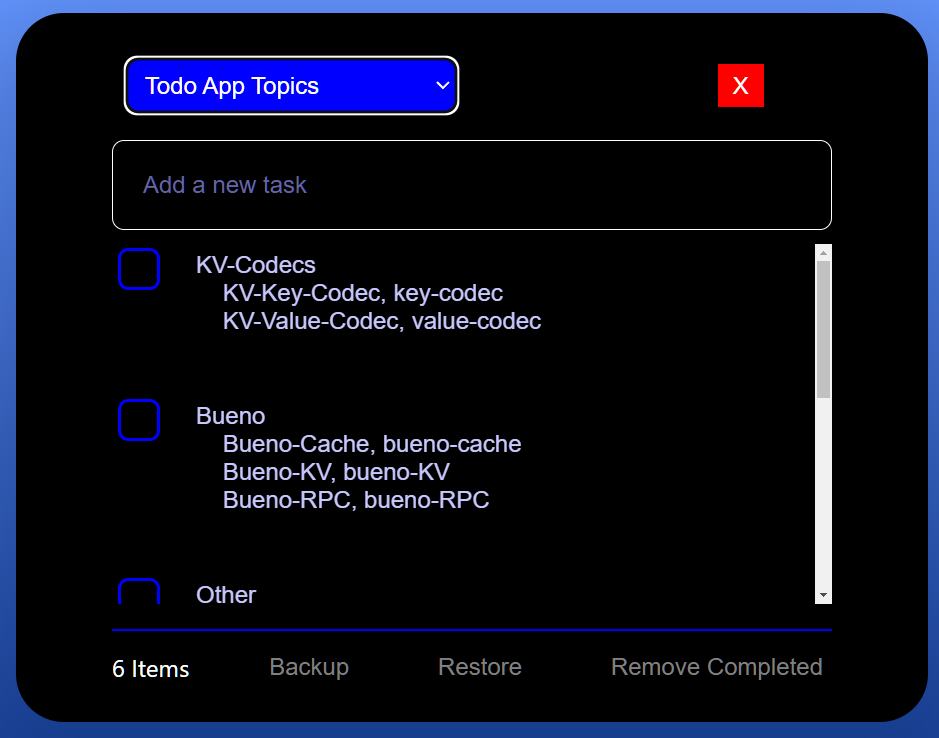

## Todo List App

This simple app allows me to organize Todo-Tasks by subject and project.  

### NOTE: 
This client app requires a simple remote Kv-RPC Service.    
See: https://github.com/nhrones/kv-ws-rpc   
In DEV mode,(running from localhost), a local DenoKv-db will       
be used. You'll need to run a local copy of the above service.    

For production, simply copy this repo and the above service repo.    
I like to run this client from Github.IO.    
I Deploy the ServeKv to Deno Deploy.     
You'll also need to change the `KV_URL` constant     
in './src/context.ts`, to your own deploy url.

### Client UI
I've used a simple selectBox to select a project.    
Once selected, all tasks for that project are listed.    
Clicking on a task, allows you to edit the text in a multi-line TextArea element.    

### Try it:  https://nhrones.github.io/To-Do-List/

<br/>



### Tasks
To add a task, just type in the textInput and press enter.    
To edit a task, just click on it.     
An editable multiline TextArea will allow in place edits.    
All edits are auto-saved on 'blur'.



Each task has a `completed` checkBox.    
The `Remove Completed` button on the bottom-right will delete any _checked_ tasks.    

<br/>

### Todo Topics
The dropdown box shows all current option groups and todo topics.    
These are configurable by the user; see below.    
The image above shows the `DWM-ReactiveUI` topic selected with it's current task list.    



<br/>

### Configurable Topics
Note, the `Topic-Select-List` is configurable directly in the app. Just select `Todo App Topics` in the drop-down, then click on a topic-set to edit it.  
As you'll see this list is what populates the select-dropdown
You can add or modify these values.  The format is as follows:
```
Text on the top-line will be a _select-option_ ( a grouping )  
Each line below represent a _topic, key_ pair;  TopicName, KeyName.
The spacing/formatting is not defined, but the comma is required.
Note that the key is used in the db to organize tasks by topic.
``` 
Any changes will show only after a _restart_ or _tab refresh_. 
### Be careful here. 
Any key change may cause orphaned db-tasks. I recommend doing a backup prior to editing the topics list.



### Kv service
This version uses DenoKv in a very simple Deploy Kv-service.
You'll find the server repo at: https://github.com/nhrones/ServeKv

### Backups
The backup and restore buttons allow backing up the data to a json file.    
I like to do daily backups to keep a historical record.    
(you can restore any backup, any time!).    
You could use the backups as an organization feature; work - personal? 
On first start, the kvDb will be empty.    
You can use the apps `restore` button to restore the default tasks 
list from './backups/default.json`.


## Deno Desktop App
I started this project as a DWM-ReactiveUI app.     
I liked the look-and-feel of my Deno-Desktop version so much, that I spent time creating this HTML version.   
Building this HTML version was very difficult for me as I have limited CSS experience.    

## Have Fun! Make a copy and clean up my clumsy code.